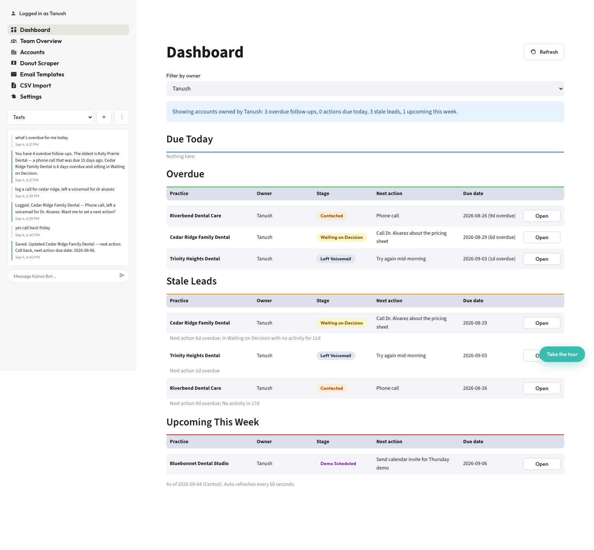
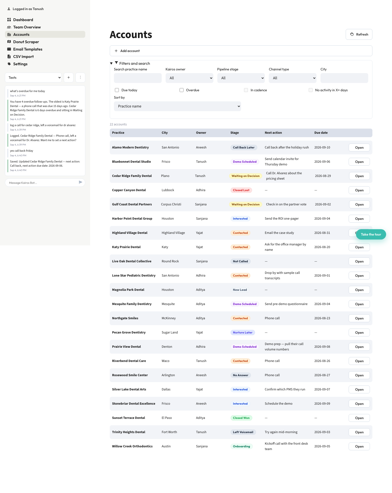
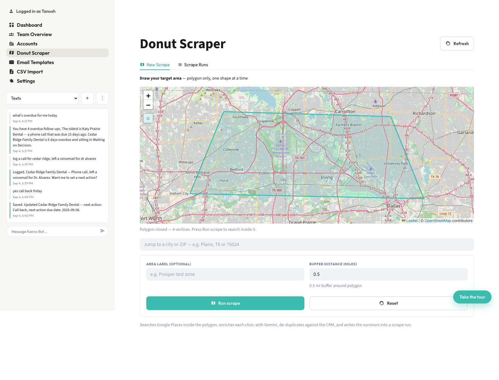
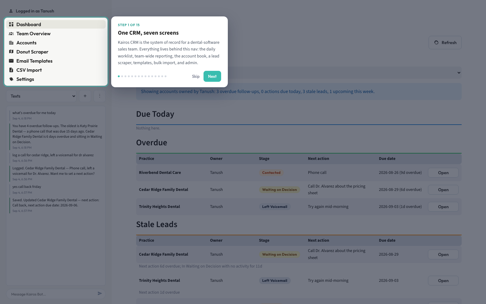

# Kairos CRM

An internal sales CRM I built for the Kairos Health sales team — the system of record for a small
team selling AI phone software into dental practices. It tracks accounts, contacts, activity
history, demos and email templates, finds new leads by scraping a map polygon, and is reachable over
SMS.

**[▶ Try the interactive demo](https://yajatp.github.io/kairos-crm/)** — a guided tour walks through
every screen. All data in the demo is fictional.



---

## What it does

| | |
|---|---|
| **Dashboard** | The daily worklist. Every account is bucketed into due today / overdue / stale / upcoming, computed live. |
| **Team Overview** | The same data aggregated across the team: pipeline by stage, load per rep, what is closest to closing. |
| **Accounts** | The account book. Composable filters, then a detail view with Details / Contacts / Activity Log / Demos tabs. |
| **Donut Scraper** | Draw a polygon on a map; it searches Google Places inside it, enriches each clinic with Gemini, de-duplicates against the CRM, and returns a call list. |
| **Email Templates** | Categorised outreach templates with the situation each one is for. |
| **CSV Import** | Column mapping, batch defaults, preview, duplicate review, commit. |
| **Settings** | Users, channel types and cadences editable without a deploy. |
| **Text bot** | A SendBlue number backed by a Supabase edge function. Reps text it from the car and it logs activity and sets next actions. |



## Stack

- **Streamlit** multi-page app (`app.py` + `views/`)
- **Supabase / Postgres** — the single source of truth for every read and write
- **Google Places + Gemini** for lead discovery and enrichment (`pipeline/`)
- **SendBlue + Supabase edge functions** for the SMS bot (`supabase/functions/sendblue-bot/`)
- **rapidfuzz** for duplicate detection

## Design decisions worth explaining

These are the calls that took the most thought, and the reasoning behind each one.

**Derived state, not stored state.** `last_action_date` and an account's current state are computed
from the `activities` table through the `account_overview` view rather than written onto `accounts`.
Denormalising them would have been faster to query and would have drifted the first time anything
wrote an activity without updating its parent.

**The one write that had to be atomic.** Logging an activity also has to update the parent account's
`next_action` and `next_action_due_date`. Doing that as two calls from Python means a crash between
them leaves an account whose next action disagrees with its own history. It runs as a Postgres
trigger (`sync_account_next_action`) instead, so the pair either both land or neither does.

**All date logic in America/Chicago, unconditionally.** Timestamps are stored in UTC, but "due
today", "overdue" and "stale" are evaluated in Central time regardless of where the server or the
browser is. A follow-up that is due today has to mean the rep's today, not the server's.

**Duplicate detection warns; it never decides.** Both the CSV importer and the scraper flag likely
duplicates and stop for a human. Silently skipping or auto-merging is how a CRM quietly loses a
deal, so the app refuses to do either — it shows the match, the confidence and the two records, and
the user chooses.

**No auth, deliberately.** A small team that trusts each other does not need a permissions model,
and one would have put a login screen between a rep and a lead they need to log in ten seconds.
Picking a name on the way in pre-fills the owner field everywhere and never locks anyone out of
anyone else's records.

**No auto-refresh on any page with a form.** A rerun destroys unsaved input. The dashboard refreshes
on a timer because it is read-only; every page with an edit form refreshes only when asked.



## Repository layout

```
app.py                     entry point, navigation, sidebar chat
views/                     one module per page
db/                        Supabase client and every query
pipeline/                  Places search, Gemini enrichment, dedup, classification
utils/                     constants, timezone, staleness rules, dedup, styling
schema.sql                 tables, the account_overview view, triggers
supabase/functions/        the SendBlue webhook edge function
supabase/migrations/       schema history
CRM_SPEC.md                the spec the app was built against
docs/                      the static demo site published to GitHub Pages
```

## Running it

The app needs a Supabase project of its own.

```bash
pip install -r requirements.txt
cp .env.example .env          # Supabase, Gemini, Places and SendBlue keys
# run schema.sql in the Supabase SQL editor, then:
streamlit run app.py
```

`schema.sql` creates every table, the `account_overview` view, the next-action sync trigger, and
seeds the initial users and channel types.

### The text bot

Inbound texts hit a Supabase edge function, which matches the sender's number against `users.phone`,
runs Gemini with CRM tools against the same database, and replies over iMessage/SMS.

```bash
supabase link --project-ref <ref>
supabase secrets set GEMINI_API_KEY=... SENDBLUE_API_KEY_ID=... \
  SENDBLUE_API_SECRET_KEY=... BOT_WEBHOOK_TOKEN=<random string>
supabase functions deploy sendblue-bot
```

Then register the webhook with SendBlue against
`https://<ref>.functions.supabase.co/sendblue-bot?token=<BOT_WEBHOOK_TOKEN>` for the `receive`
event, and set each team member's E.164 phone on their `users` row. Posting a payload to the
function URL with `&debug=1` returns the reply in the HTTP response, so it can be tested without
SendBlue.

## About the demo

`docs/` is a standalone client-side reimplementation of the interface, published to GitHub Pages so
the app can be explored without provisioning a database. Its layout, spacing, colours and type were
matched against the real Streamlit build's computed styles rather than approximated. The guided tour
drives the app between pages as it explains each feature, and the map polygon tool actually draws.

Every practice, contact, deal and scrape run in the demo is invented. No production data appears in
this repository.


